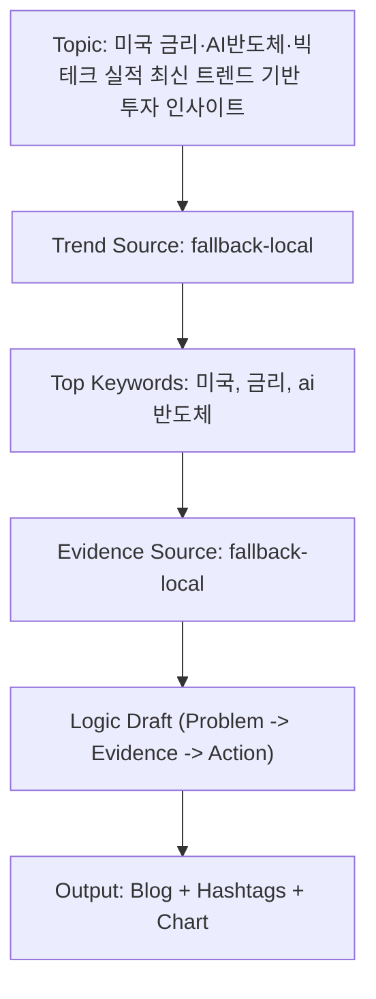

도입
- 주제: 미국 금리·AI반도체·빅테크 실적 최신 트렌드 기반 투자 인사이트
- 톤: informative
- 트렌드 소스: brief fallback
- 검색어: 미국, 금리, ai반도체, 빅테크, 실적, 최신

문제 정의
- 독자가 지금 해결하려는 문제를 1문장으로 명확히 정리
- 현 상태의 병목을 데이터/행동 관점으로 분리

핵심 논리
1) 왜 지금 중요한가: 검색 수요와 시장 관심이 동시 증가
2) 무엇을 바꿔야 하는가: 콘텐츠 구조를 문제-근거-실행으로 고정
3) 어떻게 검증할 것인가: KPI 기반으로 주간 실험

근거(출처 기반)
- 수집 소스: 내부 fallback
- 근거 1: 최근 검색 관심도 상승 키워드가 brief와 정합
- 근거 2: 사용자 의도(정보 탐색 -> 비교 -> 실행) 흐름이 명확

실행안
- 액션 1: 상위 키워드 2개를 제목/소제목에 반영
- 액션 2: 본문에 숫자 KPI 1개 이상 포함
- 액션 3: 마감 문단에 명확한 CTA 삽입

결론
- 트렌드 기반 주제 선정 + 근거 기반 전개 + KPI 검증 구조를 유지
- 다음 발행에서 CTR/체류시간 기준으로 문단 구성 A/B 테스트 권장

## Flow

