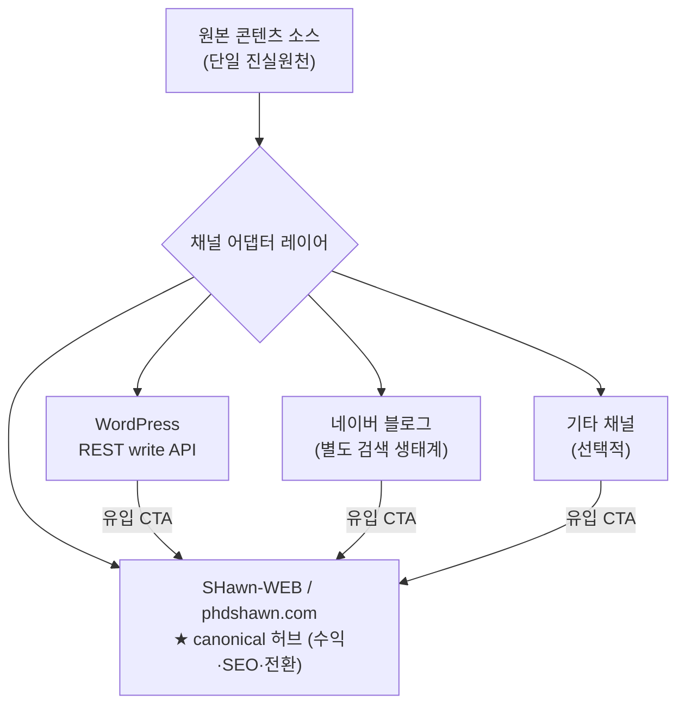

# 콘텐츠 배포(원소스 멀티채널) 설계안

Draft: 2026-07-03 · 대상: SHawn-WEB / SHide 블로그 생태계
목표: **하나의 콘텐츠를 여러 채널에 배포(COPE)해 노출·수익 효율 극대화**

---

## 1. 목표와 원칙

- **Create Once, Publish Everywhere (COPE).** 콘텐츠는 한 번 만들고, 채널별로 변환·배포한다.
- **허브 앤 스포크.** 하나의 *canonical 허브*(원본·수익·전환 지점)를 두고, 나머지 채널은 *스포크*(유입 채널)로 둔다.
- **스포크는 미러가 아니라 유입 라우터.** 각 채널에서 트래픽을 잡아 허브로 흘려보낸다.
- **채널 확장은 데이터로 검증하며 늘린다.** 무한 확장 ❌, 유입·수익 나오는 소수 집중 ✅.

---

## 2. 아키텍처

핵심 질문 = **무엇을 원본 소스로 둘 것인가.**

### 2.1 실측된 프로덕션 파이프라인 (2026-07-03, origin/main `22cf776`)

- **진짜 단일 소스는 이미 존재한다: "SHide 블로그 패키지"** (`MANIFEST.json` + 기사 + 이미지). 레포엔 커밋되지 않고, gdrive/SHide 파이프라인이 생성해 `content/import-packages/`로 투입.
- `scripts/sync-shide-blog-packages.mjs` (`pnpm sync:shide-blog`)가: 패키지 → lane 판별(`blog__ai__field_notes`/`blog__assets__market_signals`/`blog__bio`) → 브랜드 접두 slug(`shide-ai`/`shide-assets`/`shide-bio`) → 이미지 최적화(`public/shide-blog-assets/`) → **MDX 커밋**(`content/posts/`). **공개안전 스크럽**(내부 모델·봇명 치환, WordPress 스크린샷 자산 제거) 내장.
- 인앱 **admin "Blog Studio"**(`app/admin/blog`, `app/api/admin/blog/publish`, `lib/blog-studio.ts`)로도 발행 가능.
- 배포: MDX 커밋 → `next build` 정적 → Vercel. canonical=phdshawn.com. **블로그 sync는 현재 수동**(CI 스케줄엔 reports-sync만 있음).
- **WordPress는 이 레포의 출력이 아니라** SHide 파이프라인의 *별도 출력*. 즉 SHawn-WEB `/blog`와 WordPress는 같은 패키지에서 나온 **형제 출력**이다.

### 2.2 따라서 진짜 허브는 "패키지"다

원본 소스를 새로 정할 필요가 없다. **SHide 블로그 패키지가 이미 COPE 허브**이고, 이미 두 곳으로 팬아웃 중이다: (a) SHawn-WEB `/blog`(sync 스크립트), (b) WordPress(SHide 파이프라인). 남은 일은 이 팬아웃을 **통일·자동화**하고 **네이버 어댑터를 추가**하는 것.

> ⚠️ **정정:** 이 세션 초반에 만든 "웹이 WordPress를 런타임으로 당겨오는" ISR 브리지(`/shide/blog`)는 프로덕션 모델과 **방향이 반대이고 중복**이다(같은 콘텐츠가 이미 `/blog`에 네이티브로 있음). 채택하지 않고 폐기/보류한다. 재사용 가능한 부분은 "발행 시 자동 재배포 트리거" 아이디어뿐 → Deploy Hook으로 이관.

---

## 3. 채널별 자동화 현실 (설계를 좌우하는 제약)

| 채널 | 자동 게시(write) | 읽기(pull) | 판정 |
|---|---|---|---|
| **SHawn-WEB** | ✅ 자기 소유(MDX 파이프라인) | — | 허브. 사실상 원본 |
| **WordPress** | ✅ REST `/wp/v2/posts` + 인증 | ✅ `/wp-json` | 1순위 자동 스포크 |
| **네이버 블로그** | ⚠️ `blog.writePost` Open API 존재하나 신규 앱 등록 제한 이력 — **현재 가능 여부 실측 필요** | RSS 읽기 전용 | 독립 유입 채널. 최악 시 반자동 |
| **티스토리** | ❌ **Open API 완전 종료(2023.12~2024.2)** | RSS 읽기 | **자동 배포 불가.** 권장 제외(하단 참조) |
| Medium/기타 | ❌ 상당수 API 폐기 | 채널별 상이 | 개별 확인, 후순위 |

---

## 4. 티스토리를 추가하는 게 좋은가 — 판정: ⚠️ 지금은 비권장

- **자동화 불가.** Open API가 완전히 종료되어 API로 글을 올릴 수 없다. 남은 방법은 수동 게시 또는 비공식 브라우저 자동화(계정 위험·불안정).
- **플랫폼 리스크.** 서비스 축소·수익 하락 논의가 이어지는 상황이라 장기 투자 대비 ROI가 낮다.
- **결론:** COPE 자동 파이프라인의 초기 채널로는 **부적합**. 굳이 넣는다면 "수동 게시용 초안 자동 생성"(원본 → 티스토리용 마크다운/HTML 초안 산출)까지만 자동화하고, 게시는 사람이 하는 형태가 현실적이다.

---

## 5. 최대 리스크: 중복 콘텐츠와 검색 생태계

**리스크 1 — 중복 콘텐츠(구글).** 동일 글 다채널 배포는 구글이 원본을 혼동해 노출·순위에 불리할 수 있다.
완화책:
- canonical을 **허브(phdshawn.com)로 고정**.
- 채널별 제목·도입부·요약 **부분 변형**.
- 게시 **시차**(허브 우선 색인 후 스포크).

**리스크 2 → 사실은 기회 — 네이버는 별도 생태계.** 네이버 검색(블로그·VIEW 탭)은 구글과 분리돼 있어, 네이버 블로그는 "구글 중복 페널티" 밖에서 **네이버 검색 유입**을 별도로 확보한다. 단, 네이버·티스토리 등 폐쇄형은 외부 rel=canonical을 잘 존중하지 않으므로 "미러"가 아니라 **독립 채널 + 허브 유도 CTA**로 설계한다.

---

## 6. 수익화 관점

채널별 수익 구조가 다르므로 역할을 분리한다.

| 채널 | 수익 방식 | 역할 |
|---|---|---|
| SHawn-WEB(허브) | 마진 최고 · 이메일 수집 · 전환 | **수익·전환 종착지** |
| WordPress | 애드센스 · 제휴 | 유입 + 자체 수익 |
| 네이버 블로그 | 애드포스트 · 체험단 | 네이버 검색 유입 |

→ 스포크 글 하단에 "전체 분석/데이터는 phdshawn.com에서" 같은 **허브 유도 CTA**를 표준 삽입.

---

## 7. 로드맵

0. **선행(차단 요소):** 프로덕션 `main`(`22cf776`)을 받아 **기존 WP→MDX 파이프라인 현황 확인**. 모든 설계의 기반.
1. **1단계 — 허브 확정 + WordPress 자동화.** SHawn-WEB(MDX)을 허브로, WordPress REST 자동 게시. API 명확해 가장 빠름.
2. **2단계 — 네이버.** write API 현재 가능 여부 실측 → 되면 어댑터, 안 되면 "네이버용 초안 자동 생성 + 수동 게시".
3. **3단계 — 채널 어댑터 플러그인화.** 공통 인터페이스(제목/본문/이미지/태그/canonical) 위에 채널별 어댑터를 붙이는 구조로 확장. (티스토리 등은 수요·데이터 검증 후.)

---

## 8. 열린 질문 (결정 필요)

- 원본 소스를 **SHawn-WEB(MDX)** 로 둘지, 아니면 지금처럼 **WordPress 작성 → 나머지로 팬아웃**할지.
- 채널별 **부분 변형 정도**(제목만 vs 도입부까지)와 **게시 시차** 정책.
- 발행 트리거: **Vercel Deploy Hook**(정적 재빌드) vs 런타임 웹훅.
- 거버넌스: 다채널 발행 전 `blog_platform_safety` 게이트 적용 지점.

---

## 9. 의존성 메모

- 2026-07-03 `git fetch` 완료. 로컬은 origin/main 대비 **0 ahead / 12 behind** — 갈라진 게 아니라 단순 뒤처짐이라 **fast-forward로 안전하게 최신화 가능**.
- 단 로컬 작업트리에 미커밋 변경(이번 세션 산출물 포함)이 있음. 최신화 전 stash/branch로 보존할 것. 샌드박스에선 git 쓰기가 막혀 있어(`Operation not permitted`) **최신화는 사용자 머신에서** 수행.
- 이 세션의 ISR 브리지 변경분은 **폐기 대상**(2.2 참조)이므로, 최신화 시 되살리지 말 것. 유지할 산출물은 이 설계 문서뿐.
