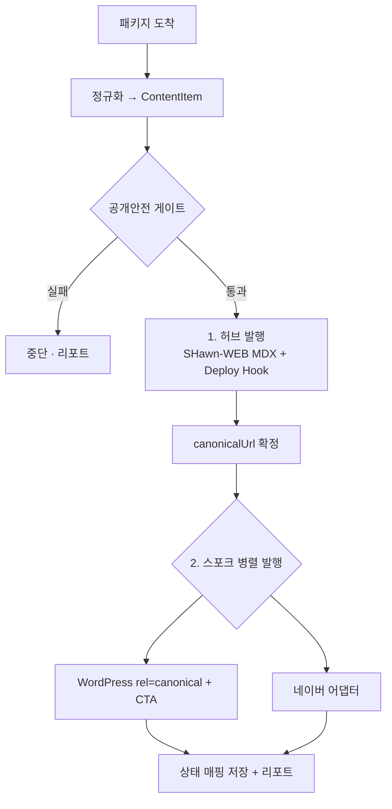

# 통합 팬아웃 오케스트레이터 사양서

Draft: 2026-07-03 · 상위 문서: `CONTENT_SYNDICATION_ARCHITECTURE.md`
목적: **SHide 블로그 패키지 1건 → 여러 채널(SHawn-WEB · WordPress · 네이버 …)로 한 번에, 멱등하게, 게이트를 통과해 발행**

---

## 1. 범위와 원칙

- 입력 단위 = **SHide 블로그 패키지**(`MANIFEST.json` + 기사 + 이미지). 이미 존재하는 단일 원본.
- **허브 우선(canonical-first).** 항상 SHawn-WEB(phdshawn.com)에 먼저 발행해 canonical URL을 확정한 뒤, 스포크는 그 canonical을 가리키며 발행.
- **멱등(idempotent).** 같은 패키지를 다시 돌려도 채널당 중복 생성 없이 업데이트. 채널별 외부 ID를 상태로 보관.
- **게이트 선통과.** 모든 채널 발행 전에 공개안전 스크럽(`public-safety-scan`, `check:forbidden-terms`, i18n)을 통과. 실패 시 전 채널 발행 중단.
- **부분 실패 허용.** 채널별 독립 실행(`allSettled`), 실패 채널은 리포트·재시도 큐로.

---

## 2. 정규화 모델 (ContentItem)

패키지를 채널 중립 표현으로 1차 변환한다.

```ts
type ContentItem = {
  packageId: string;          // MANIFEST 기준 안정 ID (멱등 키)
  lane: "ai" | "assets" | "bio";
  slug: string;               // 브랜드 접두 (shide-ai-… 등)
  title: string;
  excerpt: string;
  bodyMarkdown: string;       // 원본 본문(정규화)
  images: { path: string; role: "hero" | "inline"; alt: string }[];
  tags: string[];
  category: string;
  canonicalUrl: string;       // = https://phdshawn.com/blog/{slug} (허브 발행 후 확정)
  publishedAt: string;
  safety: { scrubbed: true }; // 게이트 통과 표식
};
```

본문은 채널별로 렌더러가 변환한다: MDX(허브) / WordPress HTML / 네이버 SmartEditor HTML.

---

## 3. 어댑터 인터페이스

```ts
interface ChannelAdapter {
  key: "shawn-web" | "wordpress" | "naver" | string;
  role: "hub" | "spoke";
  canonicalPolicy: "self" | "point-to-hub" | "unsupported";
  supportsUpdate: boolean;
  publish(item: ContentItem, ctx: PublishCtx): Promise<PublishResult>;
}
type PublishResult = {
  channel: string;
  externalId?: string;    // 멱등 매핑용
  url?: string;
  status: "created" | "updated" | "skipped" | "failed" | "manual-required";
  note?: string;
};
```

### 3.1 채널별 어댑터

| 어댑터 | role | canonical | 발행 방식 | 멱등 |
|---|---|---|---|---|
| **SHawnWebAdapter** | hub | self(phdshawn.com) | 기존 `sync-shide-blog-packages.mjs` → MDX 커밋 → Deploy Hook | slug 기준 파일 upsert |
| **WordPressAdapter** | spoke | point-to-hub(rel=canonical) | REST `POST/PUT /wp/v2/posts`, lane→사이트(AI/Assets/Bio) 매핑, 하단 허브 CTA 삽입 | 저장된 WP post ID로 update |
| **NaverAdapter** | spoke | unsupported(외부 canonical 미존중) | 별도 사양서 참조(write API or 반자동) | 저장된 logNo 또는 수동 확인 |

---

## 4. 오케스트레이션 흐름



- **순서:** 허브 → (canonical 확정) → 스포크. 스포크는 canonical을 확정된 허브 URL로 설정.
- **시차(선택):** 구글 색인 안정화를 위해 스포크 발행을 허브 발행 후 N시간 지연 옵션.
- **상태:** `content/syndication-state.json`(또는 DB)에 `packageId → { channel: {externalId, url, publishedAt} }` 매핑. 재실행 시 이 매핑으로 create/update 판단.

---

## 5. 트리거·자동화

- **수동/반자동:** admin "Blog Studio"에 "모든 채널 발행" 액션 추가(현 발행 UI 확장).
- **자동:** 패키지가 `content/import-packages/`에 도착 → CI(또는 로컬 훅)에서 `sync:shide-blog` + 오케스트레이터 실행 → 커밋 → **Vercel Deploy Hook**으로 허브 재배포.
- 현재 `reports-sync.yml`처럼 cron 워크플로를 하나 추가해 스케줄 발행도 가능.

---

## 6. 실패·안전

- 채널별 `allSettled` + 지수 백오프 재시도(네트워크/rate-limit).
- **거버넌스:** 게이트 미통과 시 전 채널 발행 금지. 네이버 등은 SHide 운영정책의 "draft-first, 1일 1공개" 준수.
- **비밀정보:** 채널 자격증명(WP 앱 비밀번호, 네이버 토큰)은 env/시크릿 매니저. 레포 커밋 금지(`credential_bridge_safety` 게이트).
- **수익화 문구 주의:** 공개면 스크럽이 노골적 수익화 표현을 제거하므로, 허브 유도 CTA는 "전체 분석 보기" 같은 **정보형**으로 설계.

---

## 7. 단계적 구현

1. 정규화 계층(ContentItem) + 상태 매핑 파일.
2. SHawnWebAdapter = 기존 sync 래핑 + Deploy Hook.
3. WordPressAdapter(REST) — lane→사이트 매핑, canonical/CTA, 멱등 update.
4. NaverAdapter — 실측 후 write or 반자동(별도 사양서).
5. admin "모든 채널 발행" 액션 + CI 자동 트리거.

## 8. 미해결 결정

- 상태 저장을 파일(git) vs DB 중 무엇으로.
- 스포크 시차 정책(즉시 vs N시간).
- 채널별 본문 변형(제목만 vs 도입부까지) 규칙의 소유 위치(패키지 메타 vs 어댑터).
